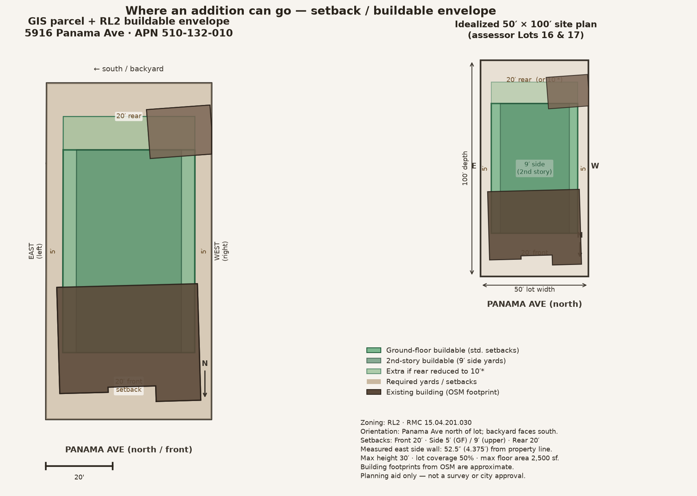

# Buildable envelope — 5916 Panama Ave

Planning map of where a **primary-dwelling addition** can go based on City of Richmond zoning setbacks, lot geometry, and related development standards.

> **Not a survey and not city approval.** GIS parcel lines are approximate. Confirm with Richmond Planning/Building before design. A licensed surveyor/architect should verify corners, existing setbacks, and front-yard averaging.

## Map

Files:

- [`buildable-envelope-map.png`](buildable-envelope-map.png) / [`.pdf`](buildable-envelope-map.pdf) — annotated site plan
- [`buildable-envelope.geojson`](buildable-envelope.geojson) — parcel, envelopes, existing footprints (WGS84)
- [`buildable-envelope-summary.json`](buildable-envelope-summary.json) — machine-readable standards used

## Zoning

| Item | Value | Source |
| --- | --- | --- |
| Zoning | **RL2** — Single Family Low Density Residential | [City of Richmond Parcel Zoning](https://experience.arcgis.com/experience/69b039ff396a463bb84acb8e537313bb) |
| General Plan | Low Density Residential (LR) | COR Planning Data |
| Overlays | None found (creek / shoreline / historic) | COR overlay layers |
| APN | 510-132-010-8 | CCMAP |
| Lot | 5,000 sq ft (Lots 16 & 17, ~50′ × 100′) | Assessor / legal description |

Standards from **RMC 15.04.201.030** (RH / RL1 / RL2 development standards):

| Standard | RL2 requirement |
| --- | --- |
| Front setback | **20′** (or average of abutting improved lots on the block face, if less) |
| Interior side (ground floor) | **5′** |
| Interior side (above ground floor) | **9′** |
| Rear setback | **20′** (may reduce to **10′** if front + rear ≥ 40′) |
| Max height (main building) | **30′** |
| Max lot coverage | **50%** → 2,500 sq ft on this lot |
| Max residential floor area | **2,500 sq ft** total (`2,125 + 0.3 × (5,000 − 3,750)`) |

## What the colors mean

- **Green (lighter)** — ground-floor buildable envelope under standard setbacks (~2,400 sq ft)
- **Green (darker overlay)** — tighter second-story envelope with 9′ side yards (~1,910 sq ft)
- **Light green strip toward rear** — extra area if the optional 10′ rear setback is used
- **Tan** — required yards (cannot place main-building addition here under these setbacks)
- **Brown** — existing building footprints from city/OSM data (approximate)

## Practical takeaways for an addition

1. **Most room is typically toward the rear** of the house, inside the green envelope — still keeping the rear yard setback.
2. **Side additions** are limited: only ~5′ clear to each side for a one-story wall (and the existing house already occupies much of the width).
3. **Second stories** need **9′** side setbacks, so upper floors are narrower than the ground floor.
4. **Floor-area budget:** existing TLA ~842 sq ft → roughly **1,658 sq ft** of residential floor area remaining under the 2,500 sq ft cap (subject to how garages/exclusions are counted).
5. **Lot coverage budget:** total building footprints (house + garage + addition) ≤ **2,500 sq ft**.
6. **Building code (CRC/CBC)** still applies inside the envelope (egress, light/air, fire separation at walls/openings near property lines, structural, energy, etc.). Zoning setbacks are usually the first filter for *where*; the code governs *how*.

## Site orientation

| Direction | What it is |
| --- | --- |
| **North** | Panama Ave (front) — street runs east–west |
| **South** | Backyard / rear yard |
| **East** | Left side when facing the house from Panama |
| **West** | Right side when facing the house from Panama |

## Measured setbacks (owner)

| Item | Value |
| --- | --- |
| East side wall to parcel line | **52.5″ (4.375′)** — runs parallel |
| Source | Owner field measurement (supersedes OSM ~3.2′ estimate) |

See [`left-rear-addition-setback-check.md`](left-rear-addition-setback-check.md) for the flush vs. pull-in addition check.

## Assumptions

- Treated as an interior lot (not a corner); street-side setback not applied.
- Used code table setbacks (front 20′ / rear 20′), not measured neighbor averages.
- Did not apply ADU-specific setbacks (state/local ADU rules differ if that is the project type).
- Existing footprints are OSM-derived via the city layer and may not match a survey — prefer field measurements.

## Next verification steps with the City

1. Confirm RL2 and any pending zoning map updates with Planning.
2. Ask whether front-yard averaging applies on this Panama Ave block face.
3. Confirm whether a rear setback reduction to 10′ is acceptable for the proposed addition.
4. Check design review / addition compatibility standards (RMC 15.04.201.040).
5. Building Division plan check for CRC/CBC, including any fire-rating needs near property lines.
